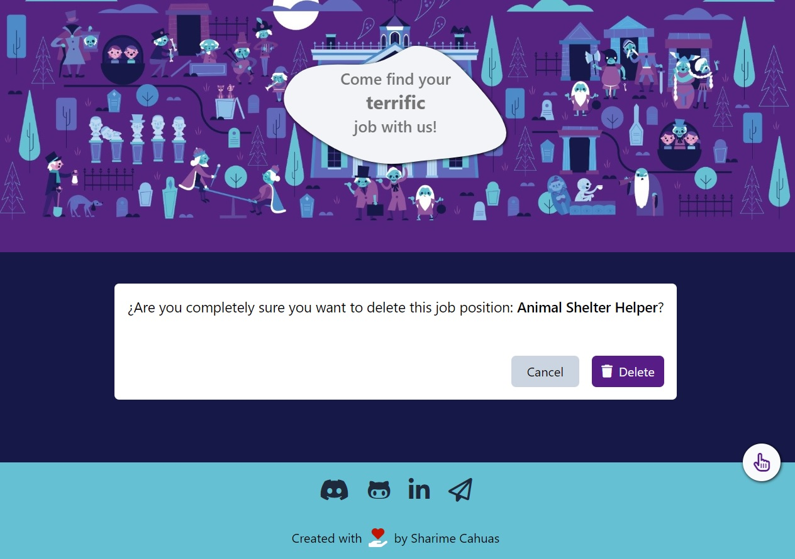

# **MONSTER JOBS - JOB APP FOR MONSTERS - ADA ITW**

Deploy link: 

MONSTER JOBS allows the person responsible for updating the Web to mantain the APP by posting, editing and deleting jobs as needed.

Project developed as an assignment for the Frontend Developement Course at ADA ITW to learn about Asinchronism. I used the following technologies and frameworks: 
HTML5
Tailwind for CSS
Javascript
Font Awesome versión 6.4.0
Mockapi

## Screenshots to show the APP responsiveness

## *Desktop* - *INITIAL WINDOW*

## *CARD JOBS*

## *DETAIL CARD JOB*

## *ADD JOB FORM*

## *EDIT JOB FORM*

## *Tablet* - *INITIAL WINDOW*

## *DELETE MODAL*

## *Mobile*  - *CARD JOBS*

## Design detail:

The HERO BANNER contains the slogan which when hovered allows the slogan to change and show the spooky one.

The loader is a Frankenstein's Monster Dancing doing "THE FLOSS" dance move.

### THANKS TO THE PACIENCE AND DEDICATION OF OUR TEACHERS:
*PILAR FIGUEROA, SOFIA FERRER AND LORENA PETRIELLA*
DURING THE COURSE OF THE 4TH MODULE

### *THANKS FOR YOUR VISIT*